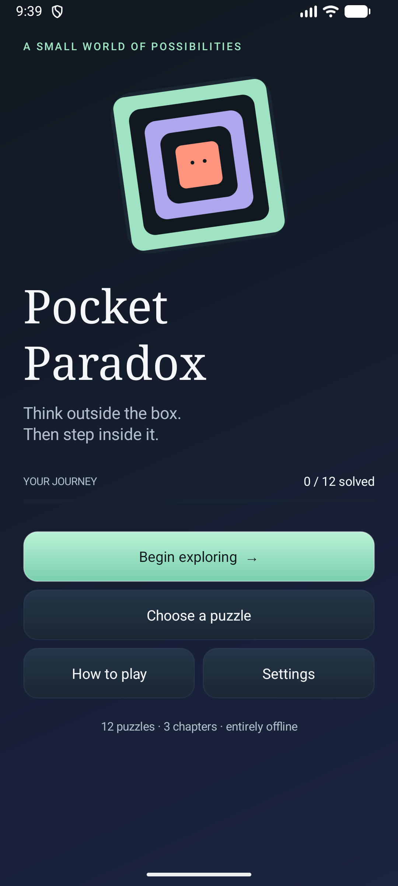
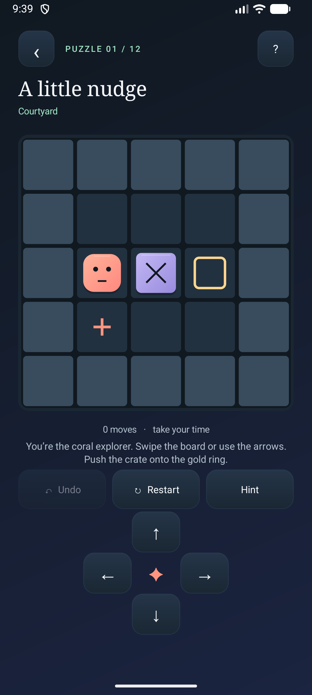
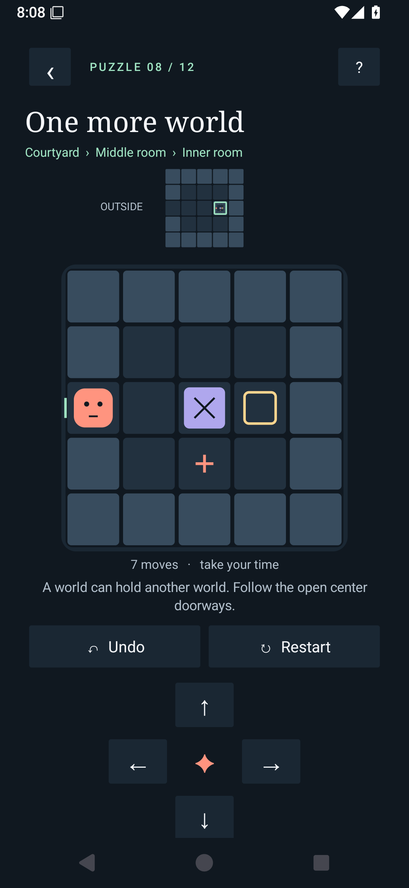
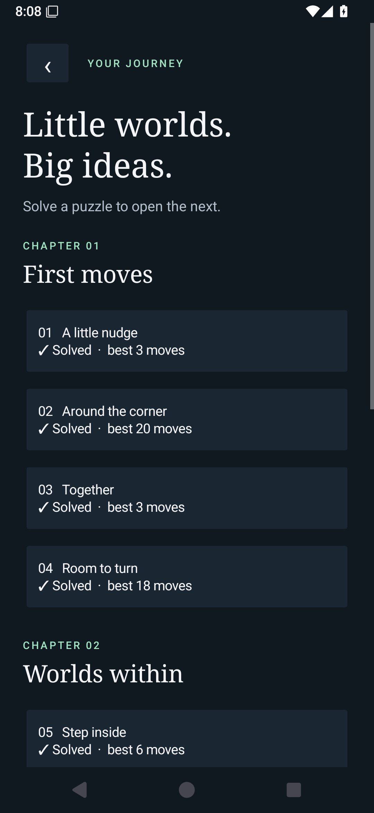
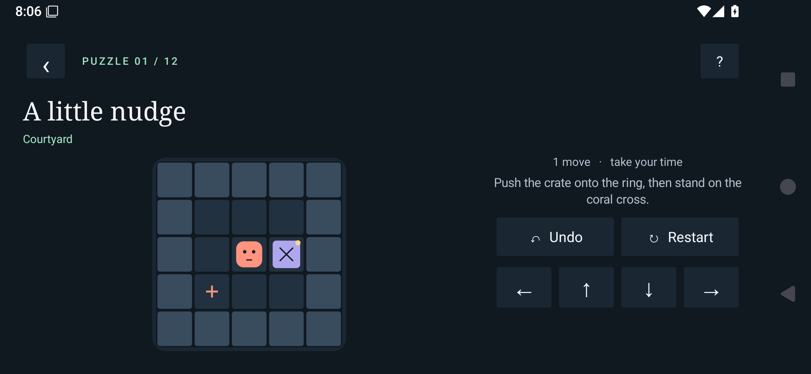
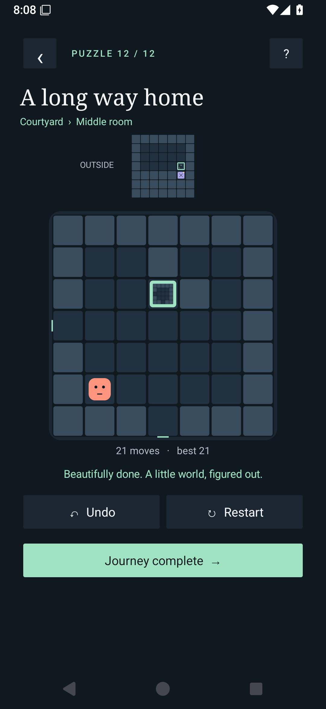

<div align="center">

# Pocket Paradox

### Small rooms. Unexpected possibilities.

A puzzle game for Android where the box you push can be a world you step inside.

**12 original puzzles · 3 chapters · Offline play · Android 8.0+**

[Take a look](#take-a-look) · [Learn the rules](#your-first-moves) · [Build & play](#build--play) · [Explore the code](#where-to-work)

</div>

---

Push a crate. Find a doorway. Step into the box you were just moving.

Pocket Paradox turns a familiar grid into a series of worlds within worlds. Carry a room across the board, guide cargo through its doors, and discover how a small change outside can open a path inside. Every puzzle invites you to pause, experiment, and try another move.

## Take a look

<table>
  <tr>
    <td align="center"><br /><strong>Your next small adventure</strong></td>
    <td align="center"><br /><strong>Start with a little nudge</strong></td>
    <td align="center"><br /><strong>Find a world within a world</strong></td>
  </tr>
</table>

<details>
<summary>More screenshots — chapters, landscape play, and the finish line</summary>

### Choose your next puzzle



### Turn your perspective



### Complete the journey



</details>

## Three chapters. One expanding idea.

| Chapter | Your challenge |
| --- | --- |
| **01 · First moves** | Learn to push, make space, and plan your next step. |
| **02 · Worlds within** | Cross a doorway and discover rooms inside rooms. |
| **03 · Moving worlds** | Carry rooms and deliver cargo across their boundaries. |

Unlock puzzles in sequence, then revisit completed levels to improve your best move count.

- **Experiment freely.** Undo a move or restart when you want a fresh approach.
- **Pick up where you left off.** Progress and your current puzzle are saved locally.
- **Play your way.** Use direction buttons, swipes, arrow keys, or WASD, in portrait or landscape.
- **Keep it quiet.** No accounts, ads, analytics, network services, or requested permissions. The game works offline.

> **A challenge for your second playthrough:** revisit a solved puzzle and beat your own move count.

## Your first moves

1. Move the **coral explorer** around the board.
2. Push crates or room boxes onto the **square-ring goals**.
3. When a room box cannot move, approach its open center doorway to **step inside**.
4. Leave through a room's centered opening to emerge beside its box in the outer room.
5. Fill every box goal, then stand on the **coral cross** to finish.

Moving a room box carries everything inside it. That is where the puzzles start to unfold.

| Action | Controls |
| --- | --- |
| Move | On-screen arrows, board swipes, arrow keys, or WASD |
| Undo | Undo button or Z |
| Start the puzzle again | Restart button |

## Build & play

Pocket Paradox is a native Java Android app, currently version **0.1.0**. Build a debug APK locally to play on a device or emulator; generated APKs are not tracked in this repository.

### Android Studio

1. Open this repository in Android Studio and let Gradle sync finish.
2. Install **Android SDK Platform 36** if prompted, and create or start an emulator in Device Manager. A connected Android 8.0+ phone also works.
3. Select the **app** Android App run configuration and your device.
4. Click **Run ▶** to build, install, and launch the game.

Running `:app:testDebugUnitTest` only runs the unit-test task; use the app run configuration to install and launch the game.

### Command line

Use a local JDK and Android SDK installation:

```sh
export JAVA_HOME=/path/to/your/jdk
export ANDROID_HOME=/path/to/your/android/sdk
./gradlew :app:assembleDebug
```

The APK is written to:

```text
app/build/outputs/apk/debug/app-debug.apk
```

Drag that APK onto a running Android emulator, or install it on a connected device with:

```sh
adb install -r app/build/outputs/apk/debug/app-debug.apk
```

Then open **Pocket Paradox** from the app drawer.

<details>
<summary>Build configuration and release notes</summary>

The checked-in wrapper uses **Gradle 9.6.0** and **Android Gradle Plugin 9.4.0**. Daemon JVM criteria select **JetBrains JDK 21**, while Java source targets **17**. The app compiles and targets SDK **36**, with a minimum SDK of **26**. The first build may download the JDK and build tools.

You can also set the SDK location in an untracked `local.properties` file. Debug APKs use a development signing key.

To build a release bundle:

```sh
./gradlew :app:bundleRelease
```

Configure your own release signing before publishing. A production application ID, release key, store listing, wider device testing, and a longer campaign remain release tasks.

</details>

## Check the rules

```sh
./check.sh
./gradlew :app:lintDebug
```

The plain-Java checks exercise pushes, centered entry/exit, blocked-move rollback, containment rejection, goals, undo, and malformed-save validation. They replay a winning transcript for every level and run 24,576 seeded moves, checking save/restore, undo, and deterministic replay. No test framework or runtime dependencies are needed.

An optional UI check runs on a connected **emulator only**, with the APK already installed. It resets this game's data in that emulator and captures screenshots under `dist/screenshots`:

```sh
python3 tests/android_smoke.py /path/to/adb emulator-5580 --reset-test-data
```

## Where to work

| File | Responsibility |
| --- | --- |
| `app/src/main/java/com/pocketparadox/game/Engine.java` | Android-independent movement, room ownership, undo, goals, persistence |
| `app/src/main/java/com/pocketparadox/game/Levels.java` | Original campaign, teaching hints, and solution transcripts |
| `app/src/main/java/com/pocketparadox/game/MainActivity.java` | Native screens, Canvas board, controls, lifecycle, progress |
| `tests/EngineCheck.java` and `tests/LevelCheck.java` | Runnable rule and campaign checks |

Rooms use `#` for walls, `.` for floor, `o` for a box goal, and `@` for the single player goal. Piece 0 is the player. A piece's `inside` field identifies its interior room, or is -1 for an ordinary crate/player. Each nonroot room belongs to exactly one box. Save files include a level fingerprint and reject invalid geometry or containment.

## Scope

This is a playable **finite-nesting foundation**, not full gameplay parity with Patrick's Parabox. It supports movable rooms, crates entering/exiting rooms, and two nested depths in the campaign. Self-containing boxes, eating/squeezing behaviors, duplicate room references, and infinity spaces are not implemented. Those need explicit cyclic spatial rules and their own teaching campaign. Rendering shows three preview depths; it does not impose that limit on finite engine nesting.

Native buttons have accessibility labels, goals use distinct glyphs, and the board describes player/piece/goal coordinates to accessibility services. Portrait pages can scroll on small screens or enlarged fonts, and landscape uses side-by-side play and controls. A dedicated nonvisual puzzle-navigation mode remains future work.

The [official game description](https://www.patricksparabox.com/) and [creator interview](https://www.gamedeveloper.com/design/patrick-s-parabox-/) informed the mechanical scope. No original game files or levels were used.
